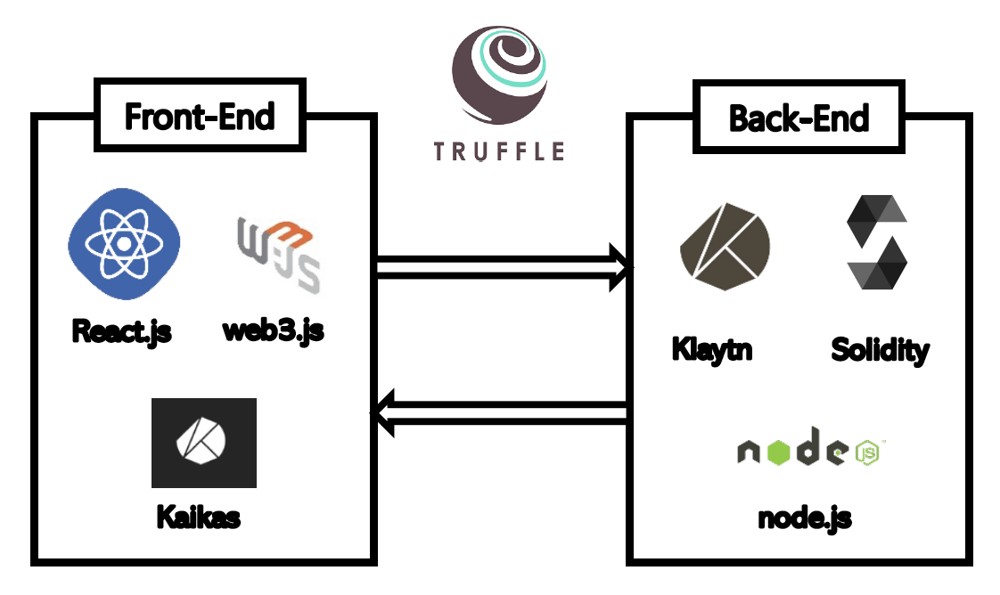

# Indian: Game Distribution Platform dApp

Indian is a Game Distribution Platform DApp such as Steam, Origin etc

## Features
* Blockchain can help Indie Game Developer
* Blockchain based investment makes more better environment for Indie Game Developer.
* Our project is for Jeju Blockchain Hackathon 2020 (제주도 블록체인 해커톤 2019)

## Installation

` npm install `

` truffle deploy --network testnet --reset `

` cd client && npm start `

` node server.js `

## Indian's Architecture

